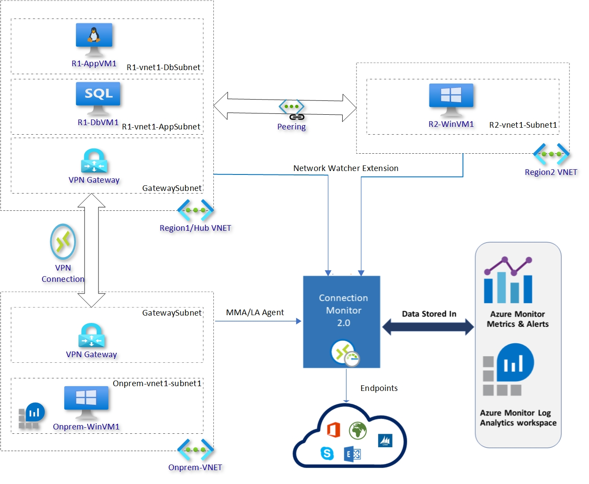

# Connection Monitor 2.0 - Demo environment setup

This repository has two Resource Manager templates which does

  - Deploy an infrastructre with specified architecture for Monitoring
  - Deploy Connection Monitor resources to monitor infrastructure deployed in previous step

A PowerShell script helps deploy both the templates with necessary parameters

  - Login to Azure account and select right subscription by invoking command ``Connect-AzAccount``
  - Invoke PowerShell to deploy the necessary resources after navigating to right folder ``PS C:\Users\user1\Monitor> .\Deploy.ps1``

<b>Note</b>: If there is error due to execution policies restrictions for unsigned scripts, change the execution policy using ``Set-ExecutionPolicy -ExecutionPolicy Unrestricted -Scope CurrentUser``

## Environment setup

The deployed architecture will look like below

  - We created a Hub region (aka region 1) which hosts the Linux App server, Windows SQL DB server and Log Analytics resources along with Connection Monitor. 
  - Region 2 hosts a Windows VM running IIS on port 80, and is connected with region 1 VNET by cross region VNET peering.
  - We have OnPrem-VNET in different region which emulates the on-premises infrastructure. This runs windows VM hosting IIS on port 80.
  - Network Watcher Extension is deployed for Azure VMs. 
  - On-premises VMa are linked to Log Analytics workspace and deployed with Microsoft Monitoring Agent (MMA)/Log Analytics Agent/OMS Agent/SCOM Agent. NetworkMonitoring solution is added to workspace for VMs to be discovered with Connection Monitor.

## Connection Monitor Scenarios

  - <b>Connectivity to Bing and Google</b>: Testing connectivity checks from VMs in Hub VNET and on-premise VMs to internet endpoints (www.bing.com & www.google.co.in)

  - <b>Connectivity from Hub region 1 to region 2</b>: Testing connectivity checks from VMs in Hub VNET and VMs in region 2

  - <b>Connectivity from Hub region 1 to On-prem</b>: Testing connectivity checks from VMs in Hub VNET and OnPrem VMs

  - <b>Connectivity from Hub region 1 web to db</b>: Testing connectivity checks from VMs with in Hub VNET

  

If you are new to Azure Connection Monitor and Network Insights, see:

- [Azure Connection Monitor documentation](https://docs.microsoft.com/en-us/azure/network-watcher/connection-monitor-preview)
- [Azure Network Insights documentation](https://docs.microsoft.com/en-us/azure/azure-monitor/insights/network-insights-overview)
- [Azure Virtual Machines documentation](https://docs.microsoft.com/en-us/azure/virtual-machines/)
- [Template reference](https://docs.microsoft.com/en-us/azure/templates/)
- [Quickstart templates](https://azure.microsoft.com/en-us/resources/templates/)

If you are new to template deployment, see:

[Azure Resource Manager documentation](https://docs.microsoft.com/azure/azure-resource-manager/)

